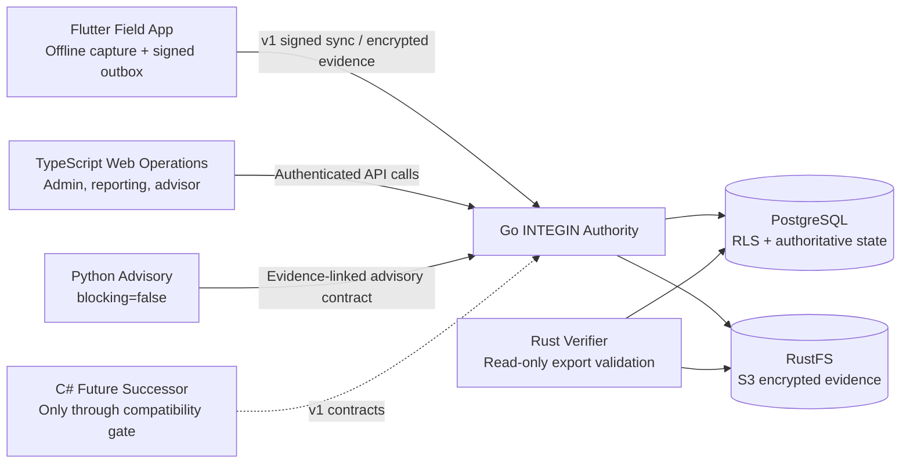

# INTEGIN Architecture Evolution Roadmap

**Author:** Manus AI  
**Status:** Architecture direction and staged decision record  
**Date:** 2026-08-14  
**Scope:** Self-hosted INTEGIN evolution beyond the current Go, PostgreSQL, RustFS, Flutter, TypeScript, and Python implementation.

## Executive Direction

INTEGIN should evolve as a **single authoritative safety platform with specialized supporting technologies**, rather than as a collection of competing backends. The current Go modular monolith remains the authority for workflow acceptance, device trust, signed sync, evidence metadata validation, tenant isolation, certificate controls, and audit behavior. PostgreSQL remains the authoritative durable store, and RustFS remains an S3-compatible evidence backend behind a vendor-neutral storage boundary. [1] [2]

> **Architectural rule:** no technology may create a second authority for inspection verdicts, certificate issuance, authorization, calibration validity, sync acceptance, or public QR disclosure.

| Technology | Long-term ownership | Explicit boundary |
|---|---|---|
| Go | Authoritative INTEGIN domain/API runtime | Decides and records primary workflow state. |
| PostgreSQL | Durable authority, tenant isolation, audit/sync state | Source of truth for business, authority, receipt, and sequence data. |
| RustFS | Encrypted evidence objects through the S3 adapter | Stores objects; never decides business state. |
| Flutter | Offline field capture and signed mutation outbox | Captures and submits; never approves or issues. |
| TypeScript | Web operations, reporting, advisory, and narrow public views | Presents approved API projections; never accesses the database directly. |
| Python | Bounded advisory analysis | Returns evidence-linked, non-blocking guidance only. |
| Rust | Independent verification, export, and edge-security utilities | Verifies and transforms; never becomes a shadow INTEGIN authority. |
| C# / ASP.NET Core | Future strategic consolidation option | Must enter only through a funded compatibility-tested migration program. |

## Non-Negotiable Cross-Language Contracts

Every technology may evolve independently only if it preserves the same safety contracts. These contracts are more important than language choice because they ensure that a Flutter client, Go server, future C# service, Python adviser, and Rust verifier all reach the same trusted interpretation of data.

| Contract | Required invariant | Current evidence |
|---|---|---|
| Tenant context | Tenant, organization, and environment are explicit and checked at every boundary. | PostgreSQL RLS and sync/device contracts. [1] [2] |
| Signed mutation envelope | The v1 canonical form includes identity, scope, sequence, authority, payload hash, timestamp, algorithm, and key ID. | Go/Dart vectors and Ed25519 validation. [1] |
| Authority | Device identity, user, organization, epoch, capability, and time window must all bind. | Durable device/authority repository and live matrix. [1] |
| Sync outcomes | `APPLIED`, `DUPLICATE`, `HELD`, `CONFLICT`, and `SECURITY_FAILURE` remain explicit and durable. | Live PostgreSQL-backed matrix. [1] |
| Evidence | Plaintext and ciphertext SHA-256 values remain distinct; server persists and verifies ciphertext integrity. | Live S3 contract and application tests. [1] |
| AI boundary | AI is always `blocking=false` and excluded from primary safety/security decisions. | Advisory contracts and service design. [1] |
| Public privacy | Public verification never projects client names, sites, inspectors, findings, photos, or internal IDs. | QR privacy boundary. [2] |

## Target Operating Shape



The Go service is deliberately placed at the center because it is the only component permitted to decide whether an operation changes primary state. The Python adviser, TypeScript interfaces, and Flutter client communicate through explicit API contracts. The future Rust verifier reads exported records and objects only; it is designed to strengthen independent assurance without creating a second write path.

## Staged Evolution Roadmap

### Stage A — Operational trust foundation

The immediate priority is to finish the current Go/Flutter platform, not to introduce a rewrite. The remaining work is secure Flutter provisioning, a real field-client run, PostgreSQL and RustFS restore drills, and a documented operator recovery procedure. The recent live matrix has already proven the authoritative backend outcomes and object-store behavior; the Flutter client remains the active integration gate. [1] [3]

| Capability | Completion evidence | Exit condition |
|---|---|---|
| Field provisioning | Device has server-registered Ed25519 public key and scoped authority package. | A non-demo Flutter session can sign and submit to the live server. |
| Recovery | PostgreSQL and evidence restore drill has a dated result and verification manifest. | A restored environment passes object digest and sync-state checks. |
| Runtime operations | Health, readiness, correlation IDs, request limits, secrets handling, and logs are documented. | Operators can diagnose a failed sync without direct database editing. |
| Evidence retention | Export manifest maps evidence identity to encrypted bytes and both digests. | Evidence can be independently verified after export. |

### Stage B — Human operations and governance

TypeScript should become the primary web experience for supervisors, administrators, compliance users, and advisory readers. It should receive least-privilege API projections rather than direct database access. The first meaningful additions are device enrollment review, authority expiry/revocation visibility, held transaction handling, evidence metadata, audit search, reports, and a deliberately separate advisory console.

| Web capability | Owner | Safety rule |
|---|---|---|
| Device/authority management | Go API + TypeScript operations UI | Enrollment and revocation remain server-authoritative. |
| Sync operations | Go API + TypeScript operations UI | A human may review a held transaction but cannot bypass cryptographic validation. |
| Audit and exports | Go API + TypeScript reporting UI | Exports are tenant-scoped and include verification metadata. |
| Advisory signals | Python + TypeScript advisor UI | Every result remains evidence-linked and `blocking=false`. |
| Public verification | Go API + narrow TypeScript page | Privacy-safe projection only. |

### Stage C — Independent verification and customer trust

Rust should first enter INTEGIN as a small, independently compiled verifier rather than as a replacement backend. Its first command should accept an exported INTEGIN manifest, signed receipts, authority data, and encrypted evidence objects, then verify object digests and Ed25519 signatures without a write-capable connection to the primary database.

> **Desired assurance statement:** “This export was verified independently against its recorded evidence digests and signed transaction envelopes.”

| Rust verifier input | Verification | Output |
|---|---|---|
| Export manifest | Object-key, tenant, and evidence-ID structure | Manifest validity report |
| Evidence object | Ciphertext SHA-256 against manifest | Object integrity result |
| Transaction receipt | Canonical v1 envelope and Ed25519 signature | Signature result |
| Authority package | Scope, epoch, expiry, identity, and signature | Authority validity result |
| Audit bundle | Ordering and referenced-object completeness | Audit-export attestation |

### Stage D — Bounded intelligence

Python should expand only after evidence, audit, and authority flows are stable. Suitable capabilities include regulatory document extraction, non-blocking trend identification, recurring finding summaries, report drafting, and standards-assistance workflows. Python must remain read-oriented, pass only approved evidence references, and never receive a privileged workflow mutation capability.

| Permitted Python function | Prohibited Python function |
|---|---|
| Summarize evidence-linked trends | Compute or override a safety verdict |
| Identify non-binding anomaly patterns | Issue, revoke, or modify a certificate |
| Draft a report for human review | Authorize a user or device |
| Compare a regulation document with templates | Accept sync or change authority scope |

### Stage E — Future C# decision gate

C# is the best future consolidation option if INTEGIN later requires one Microsoft-supported language across enterprise APIs, web UI, and field UI. It should not be introduced as a parallel authority. A C# program starts only after the criteria below are met.

| Required decision gate | Why it exists |
|---|---|
| A business reason beyond language preference | Prevents a costly rewrite without product value. |
| Stable v1 contract suite | Lets Go and C# implementations be tested against identical signed inputs. |
| Migration budget and rollback plan | Prevents a partial cutover from becoming an operational risk. |
| Replay/compatibility environment | Compares receipt, sequence, authority, evidence, and audit outcomes before production cutover. |
| Bounded first migration slice | Starts with a low-risk UI/reporting or read model—not sync, certificates, or device trust. |

The possible future target remains **ASP.NET Core + PostgreSQL + S3-compatible evidence storage + MAUI + Blazor**, while preserving the same PostgreSQL data semantics and v1 interoperability contracts. [2]

## Self-Hosted Platform Baseline

The platform should gain operational capabilities only when they reduce material risk. The following are recommended as a self-hosted baseline, but each should be introduced behind a documented operational owner and recovery procedure.

| Concern | Recommended capability | Constraint |
|---|---|---|
| Identity | Standards-based self-hosted OpenID Connect provider with MFA and organization-aware roles | API authorization remains in INTEGIN; identity does not replace tenant checks. |
| Secrets | File permissions and deployment-managed secret injection, progressing to a self-hosted secret manager if needed | No secrets in source control, browser bundles, or advisory requests. |
| Observability | Structured logs, OpenTelemetry-compatible traces, metrics, and alerting dashboard | Logs must not expose evidence bytes or private credentials. |
| Backup | PostgreSQL backup/WAL strategy plus RustFS object export and signed manifest | Success is defined by restore evidence, not backup completion alone. |
| Search | PostgreSQL search first | Add specialized search only after measured need. |
| Deployment | Docker Compose/local self-hosted deployment first | Do not add Kubernetes before a measured multi-node requirement. |

## Architecture Fitness Tests

Every material change should be tested against these questions. If a proposal cannot pass them, it should not enter the INTEGIN authority path.

1. **Authority test:** Can this component issue a verdict, certificate, authorization, calibration status, or sync acceptance? If yes, only the authoritative Go path may do so today.
2. **Tenant test:** Does every read and write carry tenant, organization, and environment context with server-side enforcement?
3. **Replay test:** Can a controlled input be replayed and produce the same accepted/rejected outcome and durable receipt?
4. **Evidence test:** Can the component prove which ciphertext bytes correspond to which evidence metadata and digest?
5. **Recovery test:** Can an operator restore this component without losing tenant boundaries, authority state, audit context, or evidence linkage?
6. **Degradation test:** If the component is unavailable, does the primary inspection/certification workflow remain deterministic and safe?
7. **Exit test:** Can the component be replaced without changing the domain contract or rewriting primary workflow rules?

## Explicitly Deferred Complexity

INTEGIN should deliberately avoid premature infrastructure. The following should be introduced only when measurements, customers, or regulatory requirements establish a clear need.

| Deferred item | Reason for deferral |
|---|---|
| Kubernetes and service mesh | A single authoritative deployment is easier to secure and recover while the product is maturing. |
| Kafka, RabbitMQ, or broad event streaming | The authoritative database transaction and existing outbox patterns are sufficient until independently measured throughput requires more. |
| Redis | Add only for an identified cache, rate-limit, or coordination requirement. |
| Microservices | They multiply tenant, audit, deployment, and recovery boundaries. |
| Full C# or Rust rewrite | Must first prove compatibility and strategic value. |
| Autonomous AI agents | Conflict with INTEGIN’s safety and human-accountability boundaries. |

## Decision Summary

The improved INTEGIN vision is not “use every technology.” It is to **use each technology where it has the strongest and safest role**, while protecting a small set of contracts that must remain stable for decades.

```text
Go decides and records.
PostgreSQL preserves authority.
RustFS stores encrypted evidence.
Flutter captures work offline.
TypeScript helps people operate and review.
Python advises but never decides.
Rust independently verifies trust artifacts.
C# remains a future consolidation choice, not a present rewrite.
```

## References

[1]: ./task_plan.md "INTEGIN task plan and live-integration validation record"

[2]: ./ARCHITECTURE_REVIEW.md "INTEGIN architecture review and authoritative boundary recommendations"

[3]: ./LIVE_INTEGRATION_RUNBOOK.md "INTEGIN local integration, acceptance, and recovery runbook"
