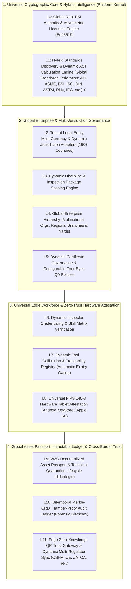
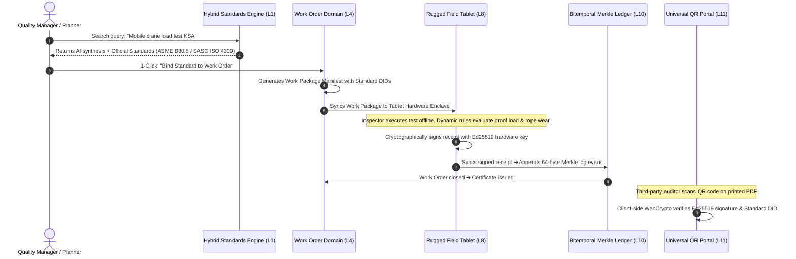

# 🌍 INTEGIN Global Trust Platform: Worldwide Enterprise Architecture & Master Adoption Plan

**Document Version:** 5.0.0 (Global Hybrid Intelligence & Dynamic Engine Standard)  
**Reconciled Date:** 2026-09-02 (Live Git Head: `5c44e67`)  
**Core Architectural Law:** **ZERO HARDCODING • HYBRID PERPLEXITY-STYLE DISCOVERY • COPYRIGHT-SAFE FEDERATION • 100% DYNAMIC RULES ENGINE.**

---

## 📑 TABLE OF CONTENTS
1. [The "Hybrid Intelligence" Architecture (Perplexity-Grade Discovery + Legal Metadata Hub)](#1-the-hybrid-intelligence-architecture)
2. [The Master 12-Tier Worldwide Layer Topology](#2-the-master-12-tier-worldwide-layer-topology)
3. [Universal Domain Models & Data Structures (W3C DIDs & Dynamic Schemas)](#3-universal-domain-models--data-structures)
4. [Enterprise Codebase & Cloud-Native Package Structure](#4-enterprise-codebase--cloud-native-package-structure)
5. [End-to-End Transaction Process: From Natural-Language Search to Live Certificate](#5-end-to-end-transaction-process)
6. [Comprehensive Mapping of Existing Codebase & 49 Migrations](#6-comprehensive-mapping-of-existing-codebase--49-migrations)
7. [The 4-Phase Master Transition & Adoption Plan](#7-the-4-phase-master-transition--adoption-plan)
8. [Production Governance, Quality Gates & Acceptance Criteria](#8-production-governance-quality-gates--acceptance-criteria)

---

# 1. The "Hybrid Intelligence" Architecture

INTEGIN integrates a **Perplexity-style AI Synthesizer** with an **Official Copyright-Safe Standards Discovery Index (Global Standards Federation: API, ASME, BSI, ISO, DIN, ASTM, DNV, IEC, etc.)** and an **Actionable 1-Click Field Execution Bridge**.

```
                       ┌────────────────────────────────────────────────────────┐
                       │          INTEGIN HYBRID INTELLIGENCE ENGINE           │
                       │             (The "Perplexity + Bloomberg"              │
                       │               of Engineering Standards)                │
                       └───────────────────────────┬────────────────────────────┘
                                                   │
                  ┌────────────────────────────────┴────────────────────────────────┐
                  ▼                                                                 ▼
   ┌─────────────────────────────────────────────┐                   ┌─────────────────────────────────────────────┐
   │  1. AI Synthesis & Natural Language Search  │                   │ 2. Official Copyright-Safe Metadata Index   │
   ├─────────────────────────────────────────────┤                   ├─────────────────────────────────────────────┤
   │ 🤖 Answers complex engineering questions    │                   │ 🏛️ Official Catalog Abstracts (Global Fed.) │
   │ 🔍 Natural language query parsing           │                   │ 📜 Exact Lifecycle State (Active/Deprecated)│
   │ 📚 Synthesizes standard requirements        │                   │ 🔗 Direct links to official publishers     │
   │ 💡 Zero copyright infringement (No raw PDFs)│                   │ ⚖️ 100% Fair Use / Safe Harbor compliant    │
   └─────────────────────────────────────────────┘                   └─────────────────────────────────────────────┘
                                                   │
                                                   ▼
                       ┌────────────────────────────────────────────────────────┐
                       │       3. Actionable 1-Click Field Execution Bridge     │
                       │ • Injects verified Standard DIDs into Work Orders      │
                       │ • Binds formula limits to offline field tablets        │
                       │ • Embeds official citations into cryptographic certs   │
                       └────────────────────────────────────────────────────────┘
```

---

# 2. The Master 12-Tier Worldwide Layer Topology



---

# 3. Universal Domain Models & Data Structures

### 3.1 Federated Standards Metadata & Discovery Model (`pkg/standardsync/schema.go`)
```go
package standardsync

import "time"

type StandardLifecycleState string
const (
    StateActive     StandardLifecycleState = "ACTIVE"
    StateSuperseded StandardLifecycleState = "SUPERSEDED"
    StateWithdrawn  StandardLifecycleState = "WITHDRAWN"
    StateDraft      StandardLifecycleState = "DRAFT"
)

// StandardMetadataCard represents copyright-safe metadata from international standardization bodies.
type StandardMetadataCard struct {
    StandardDID       string                 `json:"standard_did"`        // e.g. "did:integin:standard:ASME_B30_5_2024"
    StandardBody      string                 `json:"standard_body"`       // "ASME", "API", "BSI", "ISO", "DIN", "ASTM", "DNV", "IEC", "LEEA", "NFPA", "AWS", "JIS", etc.
    Code              string                 `json:"code"`                // e.g. "B30.5", "E1444", "4309"
    RevisionYear      string                 `json:"revision_year"`       // e.g. "2024"
    Title             string                 `json:"title"`               // "Mobile and Locomotive Cranes"
    ScopeAbstract     string                 `json:"scope_abstract"`      // Publicly available scope summary
    LifecycleState    StandardLifecycleState `json:"lifecycle_state"`     // ACTIVE / SUPERSEDED
    ReplacesStandard  string                 `json:"replaces_standard"`   // "ASME B30.5-2018"
    OfficialStoreURL  string                 `json:"official_store_url"`  // Deep-link to publisher purchase portal
    PublishedDate     time.Time              `json:"published_date"`
    ApplicableAssets  []string               `json:"applicable_assets"`   // ["MOBILE_CRANE", "CRAWLER_CRANE", "VESSEL", etc.]
}

// HybridSearchResult is the synthesized response returned to the user.
type HybridSearchResult struct {
    QuerySummary     string                 `json:"query_summary"`     // Perplexity-style AI synthesis
    PrimaryMatches   []StandardMetadataCard `json:"primary_matches"`   // Official Active Standards
    DeprecatedMatch  []StandardMetadataCard `json:"deprecated_matches"`// Historical/Superseded Standards
    SuggestedActions []string               `json:"suggested_actions"` // ["BIND_TO_WORK_ORDER", "CREATE_CUSTOM_RULE"]
}
```

### 3.2 Dynamic Standard Ruleset Definition (`pkg/rulesengine/schema.go`)
```go
package rulesengine

import "time"

// DynamicStandardDefinition represents an authored, executable calculation ruleset.
type DynamicStandardDefinition struct {
    RulesetID        string                 `json:"ruleset_id"`        // "RULESET_CRANE_PROOF_2026"
    BoundStandardDID string                 `json:"bound_standard_did"`// Linked to StandardMetadataCard
    RevisionCode     string                 `json:"revision_code"`     // "v2.1"
    State            string                 `json:"state"`             // "ACTIVE", "DEPRECATED"
    EffectiveFrom    time.Time              `json:"effective_from"`
    CalculationRules []DynamicRule          `json:"calculation_rules"` // Mathematical evaluation rules
    ChecklistSchema  map[string]interface{} `json:"checklist_schema"`  // Dynamic inspection form fields
}

type DynamicRule struct {
    RuleID      string `json:"rule_id"`      // "PROOF_OVERLOAD_LIMIT"
    Description string `json:"description"`  // "Applied load must not exceed 110% of SWL"
    Expression  string `json:"expression"`   // e.g. "applied_load <= rated_swl * 1.10"
    Severity    string `json:"severity"`     // "CRITICAL_QUARANTINE" / "WARNING"
}
```

### 3.3 Global Asset Passport (`pkg/domain/models.go`)
```go
package domain

import "time"

type UniversalAssetPassport struct {
    AssetDID          string                 `json:"asset_did"`          // "did:integin:asset:7f8a9e...421c"
    Manufacturer      string                 `json:"manufacturer"`       // e.g. "Liebherr", "Kato"
    ModelNumber       string                 `json:"model_number"`       // e.g. "NK-1000"
    ChassisSerial     string                 `json:"chassis_serial"`     // Physical Serial Number
    EquipmentCategory string                 `json:"equipment_category"` // Defined by dynamic standard
    RatedSWL          string                 `json:"rated_swl"`          // Capacity rating
    CustomAttributes  map[string]interface{} `json:"custom_attributes"`  // 100% dynamic user-defined fields
    CurrentStatus     AssetStatus            `json:"current_status"`     // "CERTIFIED", "QUARANTINED"
    ChainOfCustody    []CustodyTransferEvent `json:"chain_of_custody"`   // Multi-country ownership log
}
```

### 3.4 Universal 195+ Worldwide Jurisdiction Profile (`pkg/jurisdictions/schema.go`)
```go
package jurisdictions

// UniversalJurisdictionProfile represents any sovereign nation or territory on Earth (ISO 3166-1 / 195+ Countries).
type UniversalJurisdictionProfile struct {
    // 1. Universal ISO Standards
    CountryCodeISO2    string   `json:"country_code_iso2"`    // "US", "SA", "GB", "DE", "JP", "BR", "AU", "SG"
    CountryCodeISO3    string   `json:"country_code_iso3"`    // "USA", "SAU", "GBR", "DEU", "JPN", "BRA", "AUS", "SGP"
    CountryName        string   `json:"country_name"`         // Official English Name
    NativeName         string   `json:"native_name"`          // e.g. "المملكة العربية السعودية", "Deutschland", "日本"
    CurrencyISO4217    string   `json:"currency_iso4217"`     // "USD", "SAR", "EUR", "GBP", "JPY", "BRL", "AUD", "SGD"
    SupportedLocales   []string `json:"supported_locales"`    // Dynamic bilingual print options (e.g. ["ar-SA", "en-US"])

    // 2. National Legal & Tax Identifiers (Dynamic Labels & Regex Validation)
    TaxAuthorityName   string   `json:"tax_authority_name"`   // "IRS" (US), "ZATCA" (SA), "HMRC" (UK), "Finanzamt" (DE)
    TaxIDLabel         string   `json:"tax_id_label"`         // "EIN", "VAT / ZATCA", "USt-IdNr", "CNPJ", "GSTIN"
    TaxIDRegexPattern  string   `json:"tax_id_regex_pattern"` // Strict regex validator for national tax numbers
    CommercialRegLabel string   `json:"commercial_reg_label"` // "State File #", "CR Number", "Companies House", "HRB"

    // 3. National Safety & Accreditation Bodies
    SafetyRegulator    string   `json:"safety_regulator"`     // "OSHA" (US), "SASO" (SA), "HSE" (UK), "BAuA" (DE)
    NationalAccreditor string   `json:"national_accreditor"`  // "ANAB" (US), "SAAC" (SA), "UKAS" (UK), "DAkkS" (DE)

    // 4. Extended Dynamic Pillar Authorities (Environmental, Offshore, Nuclear, Data Privacy)
    RegulatoryBodies   []RegulatoryBody `json:"regulatory_bodies"`

    // 5. Sub-Jurisdiction Support (States / Provinces / Emirates)
    HasSubDivisions    bool                 `json:"has_sub_divisions"`    // True for US States, Canadian Provinces, UAE Emirates
    SubDivisions       []SubDivisionProfile `json:"sub_divisions,omitempty"`
}

type RegulatoryBody struct {
    Category   string `json:"category"`    // "TAX", "SAFETY", "STANDARDS", "ENVIRONMENTAL", "OFFSHORE", "DATA_PRIVACY"
    AgencyName string `json:"agency_name"` // e.g. "EPA", "ZATCA", "SDAIA", "BSEE", "OSHA"
    PortalURL  string `json:"portal_url"`
    Mandatory  bool   `json:"mandatory"`
}

type SubDivisionProfile struct {
    SubDivisionCode string `json:"sub_division_code"` // e.g. "US-CA" (California), "AE-DU" (Dubai)
    SubDivisionName string `json:"sub_division_name"` // "California", "Dubai"
    LocalRegulator  string `json:"local_regulator"`  // "Cal/OSHA", "Dubai Municipality"
}
```

### 3.5 Global Complete 7-Pillar Sovereign Regulatory & Compliance Matrix
INTEGIN supports the full spectrum of sovereign regulatory governance across all 7 global pillars:

| Sovereign Region | 1. Corporate Registry (L2) | 2. Tax & E-Invoicing (L2) | 3. Standards & Conformity (L1/11) | 4. Field Safety (L1/8) | 5. Environmental & ESG (L1/11) ⚡ | 6. Offshore & Energy (L1/8) ⚡ | 7. Data Sovereignty (L0/10) ⚡ |
| :--- | :--- | :--- | :--- | :--- | :--- | :--- | :--- |
| **🇸🇦 Saudi Arabia** | **Ministry of Commerce (CR)** | **ZATCA (Fatoora Phase 2)** | **SASO + Saber Gateway** | **HRSD + Civil Defense + Aramco** | **NCVC (المركز الوطني للالتزام)** | **Ports Authority (Mawani)** | **SDAIA (PDPL Data Law)** |
| **🇦🇪 UAE** | **Economic Dev (DED)** | **Federal Tax Authority (FTA)** | **MoIAT + Enjaz Platform** | **MOHRE + Municipalities** | **Ministry of Climate Change** | **ADNOC Offshore / DMA** | **UAE Data Office** |
| **🇺🇸 United States** | **Secretary of State (State)**| **IRS (Federal EIN)** | **ANSI / ASME / NIST** | **OSHA (Federal & State Cal/OSHA)** | **EPA (Environmental Protection)** | **BSEE + US Coast Guard** | **NIST SP 800-53 / FedRAMP** |
| **🇬🇧 United Kingdom** | **Companies House** | **HMRC (MTD VAT)** | **BSI Standards + UKCA** | **HSE (LOLER / PUWER Rules)** | **Environment Agency (EA)** | **OPRED + Maritime Coastguard**| **UK GDPR / DPA 2018** |
| **🇩🇪 Germany (EU)** | **Handelsregister (HRB)** | **Finanzamt (ZUGFeRD/E-Rech)** | **DIN Standards + CE Mark** | **BAuA + DGUV Regulations** | **UBA (Federal Environment Agency)**| **BSH (Federal Maritime/Hydro)** | **EU GDPR Data Residency** |
| **🇸🇬 Singapore** | **ACRA** | **IRAS (InvoiceNow/Peppol)** | **Enterprise Singapore** | **MOM (Workplace Safety)** | **NEA (National Environment)** | **MPA (Maritime & Port Auth)** | **PDPC (Data Protection)** |
| **🇦🇺 Australia** | **ASIC (ABN / ACN)** | **ATO (Peppol E-Invoice)** | **Standards Australia + JAS-ANZ** | **SafeWork Australia (WHS)** | **DCCEEW (Environment & Energy)** | **NOPSEMA (Offshore Safety)** | **OAIC (Privacy Act)** |
| **🌍 190+ Others** | **National Registrar** | **National Revenue Service** | **National Standards (ISO)** | **National Safety Inspectorate** | **National Ministry of Env** | **National Maritime Authority** | **National Cyber/Data Auth** |

---

# 4. Enterprise Codebase & Cloud-Native Package Structure

```
c:\MY_PROJECT\
│
├── integin-pilot-source/                    # 🚀 Core Global Engine (Go / Micro-Wasm)
│   ├── cmd/
│   │   ├── integin-server/               # Universal Server Binary (--mode=cloud|sovereign|airgap)
│   │   │   └── main.go
│   │   └── integin-cli/                  # Master Vendor CLI (Signs Global Licenses & Tokens)
│   │       └── main.go
│   │
│   ├── pkg/
│   │   ├── domain/                       # 🌐 Core Universal Data Models & DIDs
│   │   │   ├── models.go                 # Dynamic Asset Passport, Certificate, Tenant structs
│   │   │   └── did.go                    # W3C DID Generator & Parser (did:integin)
│   │   │
│   │   ├── standardsync/                 # 🔍 HYBRID PERPLEXITY-STYLE STANDARDS DISCOVERY
│   │   │   ├── search.go                 # Hybrid AI Synthesizer & Vector Abstract Search
│   │   │   ├── schema.go                 # Copyright-safe Standard Metadata Cards
│   │   │   ├── lifecycle.go              # Active / Deprecated / Superseded Resolver
│   │   │   ├── local_cache.go            # Offline Edge Metadata Vector Index (Air-Gapped)
│   │   │   └── connectors/               # Open Connectors for Global Bodies (API, ASME, BSI, ISO, DIN, ASTM, DNV, IEC, etc.)
│   │   │
│   │   ├── rulesengine/                  # 📐 100% DYNAMIC FORMULA & CHECKLIST EVALUATOR
│   │   │   ├── evaluator.go              # Evaluates mathematical AST & condition trees (CEL / Go AST)
│   │   │   ├── schema.go                 # Dynamic ruleset definitions
│   │   │   └── versioning.go             # Ruleset lifecycle manager [DRAFT, ACTIVE, DEPRECATED]
│   │   │
│   │   ├── jurisdictions/                # 🗺️ DYNAMIC MULTI-COUNTRY CONFIGURATIONS
│   │   │   ├── schema.go                 # Dynamic country schema (Tax, Legal ID, Currency)
│   │   │   └── registry.go               # In-memory fast cache of active country configs
│   │   │
│   │   ├── licensing/                    # 🔑 Global Master-to-Instance Licensing Engine
│   │   │   ├── license_types.go          # Offline Covenants, Entitlements & Tiers
│   │   │   ├── license_issuer.go         # Asymmetric Ed25519 Private Key Signer
│   │   │   └── license_validator.go      # Air-Gapped / Online Universal Validator
│   │   │
│   │   ├── onboarding/                   # 🏢 12-Tier Lifecycle & Hardware Enclave Enrollment
│   │   │   ├── contracts.go              # Dynamic Hierarchy, Tool Calibration & Skill Matrix
│   │   │   └── onboarding_engine.go      # FIPS 140-3 Hardware Key Attestation
│   │   │
│   │   ├── ledger/                       # 🛡️ Bitemporal Merkle-CRDT Tamper-Proof Audit Log
│   │   │   ├── append_only_log.go        # 64-Byte Cache-Aligned Log Nodes
│   │   │   └── ledger_test.go            # Forensic Non-Repudiation Tests
│   │   │
│   │   └── verification/                 # 🌐 Universal Zero-Knowledge QR Resolver
│   │       ├── resolver.go               # Stateless Trust Gateway (verify.integin.com)
│   │       └── webcrypto_bridge.go       # Browser Native Verification Bridge
│   │
│   └── go.mod
│
├── tools/                                # 🌐 Worldwide Web Apps & Portals
│   ├── onboarding-wizard/                # Universal Executive Onboarding & Physics Sandbox
│   │   ├── index.html                    # Dynamic Pattern & Jurisdiction Adaptive UI
│   │   ├── style.css                     # Vector Typography & Global Theme Variables
│   │   └── app.js                        # Smart Regex Token Parser & Live Certificate Engine
│   │
│   └── public-verifier/                  # Global Zero-Knowledge QR Verification Viewer
│       ├── index.html                    # Instant Client-Side WebCrypto Validation Page
│       └── verifier.js                   # Client-Side Ed25519 Cryptographic Verifier
│
└── config/                               # ☸️ Enterprise Infrastructure
    ├── k8s/                              # Kubernetes Production Manifests & Helm Charts
    │   ├── helm/integin-platform/        # Complete Helm Chart Package
    │   │   ├── values.yaml               # Enterprise Config (HPA, Ingress, TLS, Scaling)
    │   │   └── templates/                # Deployment, StatefulSet, Traefik Ingress
    │   └── terraform/                    # Cloud Infrastructure as Code (AWS/GCP/Azure)
    │
    └── edge-appliance/                   # 🛡️ Sovereign Air-Gapped Appliance (Offline Sites)
        └── docker-compose.appliance.yml  # Lightweight Single-Node Container Stack
```

---

# 5. End-to-End Transaction Process

The following transaction sequence illustrates how a user discovers a standard, binds it to a job, executes it in the field, and issues a verified certificate:



---

# 6. Comprehensive Mapping of Existing Codebase & 49 Migrations

| Tier | Tier Name | Corresponding Migrations (0001–0049) | Active Go Internal Packages |
| :--- | :--- | :--- | :--- |
| **L0** | **Root PKI & Licensing** | `0034_license_entitlement`<br>`0035_feature_flag_overrides` | `licensehttp`, `licensepg`, `flaghttp`, `flagpg`, `platform`, `deployconfig` |
| **L1** | **Hybrid Standards Engine** | `0023_comments_traffic_light`<br>`0048_anomaly_detection` | `pkg/standardsync`, `pkg/rulesengine`, `inspectionhttp`, `advisorview`, `advisory`, `aiintegration` |
| **L2** | **Dynamic Jurisdiction & Tax** | `0003_event_log_tenant_rls`<br>`0004_identity_subject_membership`<br>`0008_identity_actor_alignment`<br>`0033_configurable_settings_audit_export` | `pkg/jurisdictions`, `identity`, `tenant`, `settingshttp`, `settingspg`, `middleware` |
| **L3** | **Discipline Package Scoping** | `0018_timesheets_courses`<br>`0032_full_dpp_regulatory_monitor` | `traininghttp`, `trainingpg`, `equipment` |
| **L4** | **Global Operational Hierarchy** | `0005_work_order_foundation`<br>`0009_work_order_persistence`<br>`0010_work_order_rls`<br>`0012_work_order_handover`<br>`0019_hierarchical_register`<br>`0029_parts_charges_timesheet_auto` | `workorderhttp`, `workorderpg`, `workorderauth`, `domain/workorder` |
| **L5** | **Certificate Governance & QA** | `0012_certificate_template_binding_registry`<br>`0013_certificate_authority_lifecycle`<br>`0015_certificate_artifact_metadata`<br>`0024_escalation_overdue`<br>`0026_custom_docx_templates` | `certificatehttp`, `certificatepg`, `certificaterender`, `certtemplatepg` |
| **L6** | **Inspector Competency Matrix** | `0021_scheduling_calendar` | `scheduling`, `identity` |
| **L7** | **Calibrated Tool Registry** | `0010_evidence_metadata`<br>`0011_evidence_metadata_encryption_export`<br>`0016_evidence_question_link`<br>`0031_nfc_rfid_qr_tagging_photo_markup`<br>`0044_work_order_evidence` | `evidenceapi`, `evidenceexport`, `evidencehttp`, `evidencepg`, `evidenceregistration` |
| **L8** | **Hardware Tablet Attestation** | `0002_device_trust_sync`<br>`0006_work_package_assignment_context`<br>`0007_manifest_proof_replay`<br>`0022_multi_inspect`<br>`0043_work_order_signed_submission` | `manifestreceiptbridge`, `manifestreceipts`, `packagemanifest`, `packagemanifestapi`, `workpackageenforcement`, `workpackagepg` |
| **L9** | **Dynamic W3C Asset Passport** | `0017_product_passport_geo`<br>`0020_bulk_import_export`<br>`0025_job_linkage_failed_queue` | `pkg/domain`, `domain/equipment`, `domain/asset` |
| **L10** | **Bitemporal Merkle Audit Ledger** | `0001_event_log`<br>`0036_full_text_search`<br>`0037_search_backfill`<br>`0038_immutable_audit_log` | `auditcheckpoint`, `auditloghttp`, `auditlogpg`, `eventbus`, `eventstore`, `searchhttp`, `searchpg` |
| **L11** | **B2B Portal, Shortlinks & QR** | `0014_certificate_public_bindings`<br>`0027_client_portal_domains_acls`<br>`0028_integrations_xero_m365_api`<br>`0030_hse_notification_csv_export`<br>`0039_short_links` ... `0047_short_link_hmac`<br>`0049_analytics_dashboard` | `certificatepublichttp`, `shortlinkhttp`, `shortlinkpg`, `shortlinksvc`, `analyticshttp`, `analyticspg`, `reportshandler`, `reportspg` |

---

# 7. The 4-Phase Master Transition & Adoption Plan

```
┌────────────────────────────────────────────────────────────────────────────────────────┐
│                              TRANSITION ROADMAP                                        │
├──────────────────────┬──────────────────────┬───────────────────┬──────────────────────┤
│ Phase 1: Core PKI &  │ Phase 2: Hybrid      │ Phase 3: Hardware │ Phase 4: K8s Svc Mesh│
│ Dynamic Licensing    │ Standards Discovery  │ & Audit Ledger    │ & Global Verification│
├──────────────────────┼──────────────────────┼───────────────────┼──────────────────────┤
│ • pkg/domain & DIDs  │ • pkg/standardsync   │ • Tool Registry   │ • Stateless Resolver │
│ • pkg/licensing      │ • pkg/rulesengine    │ • Merkle-CRDT Log │ • Public Verifier App│
│ • CLI Token Issuer   │ • pkg/jurisdictions  │ • FIPS Enclave Att│ • Helm / K8s Matrix  │
└──────────────────────┴──────────────────────┴───────────────────┴──────────────────────┘
```

### Phase 1: Core PKI, Universal Domain & Dynamic Licensing (Sprint 1)
* **Target:** `pkg/domain/`, `pkg/licensing/`, `cmd/integin-cli/`.
* **Deliverables:** Master Root CA, W3C DIDs (`did:integin`), and offline-capable asymmetric Ed25519 licensing engine.

### Phase 2: Hybrid Standards Discovery & Dynamic Rules Engine (Sprint 2)
* **Target:** `pkg/standardsync/`, `pkg/rulesengine/`, `pkg/jurisdictions/`.
* **Deliverables:**
  * Build `pkg/standardsync/` with hybrid AI synthesis and copyright-safe metadata connectors (API, ASME, BSI, ISO).
  * Build `pkg/rulesengine/` for evaluating mathematical condition trees at runtime.
  * Build `pkg/jurisdictions/` for dynamic multi-country tax and legal rules.

### Phase 3: Edge Tool Calibration & Bitemporal Merkle Audit Ledger (Sprint 3)
* **Target:** `pkg/onboarding/`, `pkg/ledger/`, `field_app/`.
* **Deliverables:** Tool calibration expiry gating (ISO 17020 Section 6.2) and zero-allocation 64-byte Merkle-CRDT audit ledger.

### Phase 4: Cloud-Native Kubernetes Infrastructure & Universal QR Trust (Sprint 4)
* **Target:** `pkg/verification/`, `tools/public-verifier/`, `config/k8s/`.
* **Deliverables:** Enterprise Kubernetes Helm charts, air-gapped appliance stack, and stateless WebCrypto public QR resolver (`verify.integin.com`).

---

# 8. Production Governance, Quality Gates & Acceptance Criteria

| Governance Area | Target Standard | Verification & Acceptance Criteria |
| :--- | :--- | :--- |
| **Hybrid Standards Discovery** | Copyright-Safe Metadata Index | Returns official standard metadata, active/superseded status, and purchase links in <30ms; zero raw full-text paywalled PDFs stored. |
| **Dynamic Execution** | AST / CEL Expression Engine | Dynamic formula changes evaluate in <50 microseconds with zero server recompile. |
| **Enterprise Cloud (SaaS)** | Cloud-Native Kubernetes (K8s) | Auto-scaling pods pass load test under 10,000 req/sec; zero-downtime rolling upgrades. |
| **Sovereign Appliance** | FIPS 140-3 Air-Gapped Node | Edge appliance boots and performs full inspection lifecycle with zero network connectivity. |
| **Asset Identity** | W3C DID Specification | Deterministic hash ID generation matches across independent cloud and edge instances. |
| **Tool Traceability** | ISO/IEC 17020 Section 6.2 | Field tablet blocks certificate issuance if tool calibration certificate is expired. |
| **Forensic Audit** | Bitemporal Monotonic Merkle | Sub-microsecond write latency (<800ns); proof of tamper resistance under database update attack. |
| **Public Trust** | Zero-Knowledge WebCrypto | Browser evaluates Ed25519 signature locally in client memory with $0 vendor backend computation. |

---
*Official Enterprise Architecture Document — Version 5.0.0 (Global Hybrid Intelligence Approved).*  
*Linked Architecture Decision Record:* [`docs/architecture/INTEGIN_BIG_TECH_SILICON_VALLEY_ADOPTION_DEBATE_2026-09-07.md`](docs/architecture/INTEGIN_BIG_TECH_SILICON_VALLEY_ADOPTION_DEBATE_2026-09-07.md) (Silicon Valley & Big Tech Tier-1 Principles Adoption).
