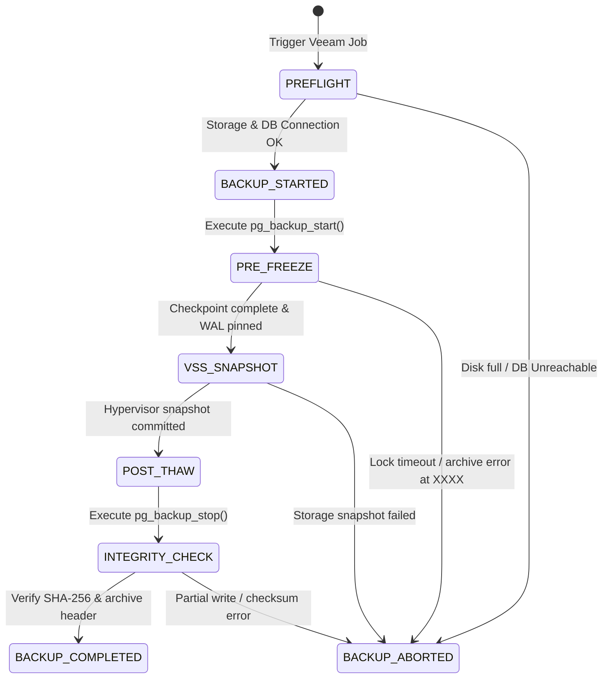

# Industry Backup Technologies & Enterprise Architecture Reference

**Date:** 2026-09-05  
**Document Status:** Reference & Decision Record  
**Target Systems:** INTEGIN PostgreSQL Cluster, Field App Evidence Stores, Container/VM Infrastructure

---

## 1. Executive Summary

This reference records the industry-standard backup technologies, their operational tiers, and the architectural dynamics of pairing hypervisor/storage snapshots (such as Veeam) with high-throughput transactional relational databases (PostgreSQL).

---

## 2. The Four Industry Backup Tiers

### Tier 1: Database-Native Point-in-Time Recovery (PITR) & Continuous Streaming
*Operates within the database engine. Target RPO: seconds to zero.*

| Technology | License / Cost | Core Mechanism | Best Fit |
| :--- | :--- | :--- | :--- |
| **pgBackRest** | Open Source ($0) | Parallel streaming, page checksums, delta backups, multi-core compression (lz4/zst), direct S3/MinIO offloading. | Gold standard for enterprise PostgreSQL (GitLab, Apple). |
| **WAL-G / WAL-E** | Open Source ($0) | Go-based continuous WAL push/pull archiver to cloud/object storage. | High-throughput distributed cloud PostgreSQL. |
| **Barman** | Open Source ($0) | EnterpriseDB's Python-based backup and DR manager with physical streaming replication. | Banking and telecommunications on-prem PostgreSQL. |
| **Percona XtraBackup**| Open Source ($0) | Non-blocking hot physical backups for MySQL and MariaDB. | Global MySQL deployments (Uber, Meta). |
| **SQL Server AlwaysOn**| Proprietary | Windows VSS engine, native differential and log shipping. | Dedicated Microsoft environments. |

---

### Tier 2: Enterprise VM & Storage Snapshot Orchestrators
*Operates at the hypervisor (VMware/Hyper-V/Nutanix) or SAN block layer.*

| Technology | License / Cost | Core Mechanism | Key Trade-offs |
| :--- | :--- | :--- | :--- |
| **Veeam Backup & Replication** | Commercial | Changed Block Tracking (CBT), Volume Shadow Copy (VSS), Application-Aware Image Processing (AAIP). | Heavy licensing costs. Prone to timeouts on write-heavy databases if pre-freeze/post-thaw scripts are unoptimized. |
| **Commvault / Rubrik / Cohesity** | Enterprise SaaS | Converged secondary data management, air-gapped immutable storage, automated cyber-recovery. | High operational overhead; tailored for Fortune 500 enterprises with petabyte-scale compliance requirements. |
| **Proxmox Backup Server (PBS)** | Open Source ($0) | Chunk-based client-side encrypted deduplication for Proxmox VMs and LXC containers. | Outstanding $0 enterprise alternative for Linux/KVM virtualization. |

---

### Tier 3: Cloud-Native & Container Orchestrators
*Operates inside Kubernetes / Cloud API control planes.*

| Technology | License / Cost | Core Mechanism |
| :--- | :--- | :--- |
| **Velero** (VMware) | Open Source ($0) | Backs up Kubernetes cluster metadata, CRDs, and CSI Persistent Volumes (PVs) to S3. |
| **Kasten K10** (Veeam)| Commercial | Kubernetes-native application data lifecycle management across hybrid clouds. |
| **AWS Backup / GCP Backup** | Cloud Native | Unified snapshot scheduler across EBS, RDS, DynamoDB, and cloud disks. |

---

### Tier 4: Immutable File & Deduplication Systems
*Cold offsite archiving, disaster recovery, and audit evidence protection.*

| Technology | License / Cost | Core Mechanism |
| :--- | :--- | :--- |
| **Restic / BorgBackup**| Open Source ($0) | Cryptographically authenticated, chunk-level deduplication with encrypted repository remotes. |
| **ZFS / Btrfs Send-Receive**| Filesystem Native ($0) | Block-level snapshot differentials transmitted over SSH; instantaneous and lockless. |
| **MinIO Object Locking / WORM**| Open Source ($0) | Write-Once-Read-Many immutable S3 buckets preventing ransomware or rogue admin deletion. |

---

## 3. Deep Dive: PostgreSQL + Veeam Snapshot Dynamics

When combining a live transactional PostgreSQL cluster with Veeam hypervisor snapshots, the backup process must enforce **Application Consistency** rather than Crash Consistency.

### The Fail-Safe State Machine

### Why "Backup Started ... Problem at XXXX ... Aborted" Occurs in Production

1. **VSS Timeout During High Write I/O**:
   - If jobs (e.g. River Queue, sensor ingest) are writing rapidly, `pg_backup_start()` checkpointing takes too long. Veeam's default snapshot timeout (60s) aborts the process.
2. **WAL Segment Disk Exhaustion**:
   - During the snapshot window, WAL logs cannot be purged. If storage runs low at block `XXXX`, the freeze aborts to prevent a database crash.
3. **Unreleased Exclusive Lock**:
   - If an earlier backup died without calling `pg_backup_stop()`, the exclusive lock causes the next run to fail immediately.

---

## 4. Recommended Target Architecture for INTEGIN

For a zero-cost ($0), enterprise-grade resilience posture:

1. **Tier 1 (Continuous)**: Deploy **pgBackRest** with local/MinIO immutable S3 bucket storage for sub-second RPO.
2. **Tier 2 (Nightly Host Image)**: Configure Veeam (or Proxmox) with tuned **Pre-Freeze / Post-Thaw scripts** executing non-exclusive `pg_backup_start()` / `pg_backup_stop()` with a 15-second watchdog timer.
3. **Tier 3 (Edge Mobile)**: Field devices maintain the offline **Cryptographic Merkle Hash Chain** (`mobile_sync_hash_chain`), ensuring mobile transactions are tamper-evident before reaching the server.
