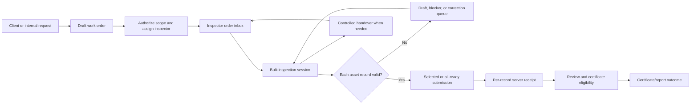

# INTEGIN High-Volume Work-Order Operating Model

**Status:** User-directed design baseline; not implemented.  
**Scope:** Future post-manifest product stream.  
**Non-interference:** This document changes no package-enforcement, acceptance, pilot, OIDC, OpenBao, certificate, inspection, database, or runtime behavior.

## Product intent

INTEGIN must support real inspection operations in which a client request or internal commercial request becomes an authorized work order, a team assigns the work to one or more inspectors, and inspectors may complete a high volume of similar assets without losing individual traceability or assurance controls. The product must reduce repetitive work while preserving the fact that each inspection, finding, evidence item, decision, receipt, and certificate outcome belongs to a specific asset and governed workflow state.

> **A work order is the operational container; an individual inspection is the technical and evidentiary unit of truth.**

## Core operating model

| Layer | Purpose | Must not do |
| --- | --- | --- |
| Client/service request | Captures the customer’s requested service, site, contacts, desired date, and proposed asset scope. | Create a passed inspection, approve evidence, or issue a certificate. |
| Work order / job number | Provides the controlled commercial and operational container for scope, assignment, due dates, status, communication, and job-level reporting. | Replace individual inspection records or override technical outcomes. |
| Authorized inspection scope | Binds each permitted asset or scope item to an approved inspection template/version and permitted workflow. | Let an inspector invent scope or alter approved requirements without authorization. |
| Bulk inspection session | Lets an inspector prepare, scan, clone, review, and submit multiple inspection records efficiently. | Turn a batch action into a bulk attestation, signature, or certificate issuance. |
| Individual inspection | Carries one asset identity, current-condition answers, measurements, findings, evidence, inspection event, and server receipt. | Borrow unique evidence, approval, or certificate authority from another asset. |
| Review/certificate outcome | Determines whether an eligible record can become a certificate/report outcome under the controlled approval policy. | Treat a job-level completion or import success as certificate authority. |

## Location-first work-order workspace

The inspector should remain inside the work order, using expandable **location sections** rather than navigating through a separate location screen for ordinary field work. A work order may contain one default location or several controlled locations. Expanding a location reveals its inspection rows and safe actions: add/select/scan a permitted item, open/continue an item, clone within the location, clone to another selected location, view exception state, or queue eligible records.

Clicking an asset ID or serial opens the type-correct form chosen from the controlled item type/subtype and approved template/version. The inspector saves and returns to the same expanded location section. Types may include equipment asset, person/competence, site/location inspection, and later controlled document verification; a person must never open an equipment form and an equipment item must never enter a training workflow.

## Inspector-facing workflow

An inspector receives orders in an **Assigned Orders** inbox in the Field application. An optional email or notification may alert them, but the authenticated application is the authoritative operational view. The inspector may have multiple active orders across clients, sites, dates, or teams.

Within an order, the inspector can work over multiple days. They may scan an asset, select it from the authorized list, add an authorized scope item, create a draft, clone a similar inspection, attach required evidence, or record why an item cannot yet be inspected. The system supports **Submit selected** and **Submit all ready**; each submitted record is processed independently and retains its own receipt. The work order remains open until all scope is submitted or a controlled disposition exists for every remaining item.

| Inspector action | Intended behavior |
| --- | --- |
| Create/continue draft | Preserves work offline under the originally assigned package/version until the compatibility/completion gate permits authoritative synchronization. |
| Clone similar asset | Copies permitted editable draft values and checklist structure, requires a unique new asset/serial identifier, and highlights every carried-forward value—including a copied defect/rejection result—for confirmation or change. It clears evidence, signatures, receipts, approvals, and certificates. |
| Add defect or rejection | Requires the defect details and any policy-required evidence before the individual record can advance. |
| Submit selected | Sends only eligible selected records; invalid or waiting records remain in the order and do not block unrelated ready items. |
| Submit all ready | Queues every independently eligible record in the current work order; submission status remains per record. |
| Continue tomorrow | Retains unfinished and blocked items with their state, package version, and audit trail. |

## Conditional evidence policy

Photographs are not universally mandatory. The approved inspection template and result state decide what is required for each record. Routine passing wire ropes, shackles, and similar items may proceed without photographs when the applicable policy does not require them. A defect, rejection, non-conformance, threshold breach, severity condition, reviewer request, or explicit template rule may require photographs and additional evidence.

Evidence must be linked to the individual asset and finding. A photograph from one asset cannot be silently cloned to another. Historical photos or previous findings may be visible as reference only and must be labeled as historical, not current evidence.

## Work-order lifecycle

| State | Meaning | Allowed progression |
| --- | --- | --- |
| Requested | Client or internal team has asked for service. | Scope/scheduling validation. |
| Drafted | Commercial/operational information is being prepared. | Authorization or cancellation. |
| Authorized and assigned | Approved scope and package references are assigned to a responsible inspector/team. | Inspection work, controlled reassignment. |
| In progress | At least one draft, completed inspection, or recorded blocker exists. | Partial submission, handover, scope disposition. |
| Partially submitted | At least one record has a server receipt while remaining scope is open. | More work, review, handover, controlled close. |
| Awaiting resolution | Remaining scope is blocked by access, client confirmation, equipment availability, or another explicit reason. | Resume, defer, cancel, or follow-up order. |
| Under technical review | Submitted record(s) or certificate candidate(s) await governed review. | Approve, reject, request correction. |
| Closed | Every scope item is submitted, cancelled, deferred, moved to follow-up, or otherwise dispositioned. | Reopen only through controlled authorization. |

## Inspector closeout, combined completion, and commercial release

An inspector may close only their **assigned scope**, not silently close a shared work order. Their closeout creates a personal timesheet/work summary derived from their assigned records, visits, time/travel fields where approved, and dispositioned blockers. The shared order remains open until every assigned inspector has closed, handed over, or otherwise resolved their allocated scope.

After the final operational scope is resolved, the office receives a combined work-order completion report. An authorized office/commercial role confirms the commercial completion basis and may create an invoice draft from approved service lines. The resulting invoice references the work order and combined summary but cannot alter inspection, evidence, review, certificate, or competence state.

## Controlled handover

When an inspector cannot finish, the office must initiate a controlled handover rather than simply changing an assignment. The original inspector synchronizes first whenever possible. INTEGIN then captures a handover snapshot: submitted/receipted items, synchronized drafts, blockers, waiting items, unstarted scope, source inspector, reason, and time. A manager assigns only the remaining authorized scope to the replacement inspector.

Submitted records remain attributed to the original inspector. Synchronized drafts transfer only as marked inherited drafts; the new inspector must review and explicitly take ownership before completing them. If the first device is unavailable or offline, the office can reassign only the server-known remaining scope and must mark the order as **unreconciled handover**. A later synchronization from the original device triggers a conflict-resolution path rather than silently creating duplicates.

## Authority boundaries

The model distinguishes convenience from authority. The following controls are deliberately **not** batchable: a technical pass/fail attestation, current-condition confirmation, defect-evidence confirmation, inspector signature, technical review, certificate approval, certificate issuance, or overwriting another inspector’s submitted record. A work order supports job-level visibility and orchestration, but it never turns a group of records into one untraceable technical decision.

## Refined operating experience

The intended experience is a single connected operating loop rather than separate sales, inspection, and certificate screens. The client or internal team opens a request; an authorized coordinator converts it to a controlled work order; the work order assigns a team, inspection scope, due window, customer/site context, and approved inspection packages. The inspector receives the order in the authenticated Field inbox, completes work by asset, and keeps moving through a high-volume session without manually rebuilding every record or document.

The office sees an honest live summary. It can see how much work is submitted, ready, draft, blocked, awaiting access, overdue, handed over, or in technical review. It does not see unsynchronized device work as completed. The customer sees only the appropriate request, scheduling, report, certificate, or status view permitted for that tenant and relationship.

## States at three separate levels

The product must not use one generic `complete` flag. A job, a session, and an inspection record need distinct states because they answer different questions.

| Level | States | Meaning |
| --- | --- | --- |
| Work order | Draft, authorized, assigned, in progress, partially submitted, awaiting resolution, under review, closed | Commercial and operational scope progress. |
| Bulk session | Open, saved offline, synchronized, submitted selection, reconciliation required, archived | The inspector’s working container for efficient preparation. |
| Inspection record | Draft, ready, queued, submitted, receipted, correction requested, rejected, approved, certificate eligible, issued/closed | The per-asset technical and evidence lifecycle. |

An order can be **partially submitted** even while some records are waiting for access or client confirmation. It closes only after each scope item is receipted, deliberately deferred, cancelled, moved to approved follow-up work, or otherwise dispositioned by an authorized role.

## High-volume productivity controls

The native INTEGIN bulk workspace should be the principal experience. It is safer for mobile/offline work, knows the assigned scope, can scan assets, validates against the currently approved package, and clearly distinguishes copied values from current evidence. A controlled import channel may later complement it for customer-provided asset lists or office preparation; it must always import first into a tenant-scoped staging area, never directly into authoritative inspection or certificate state.

| Capability | Safe behavior | Authority protection |
| --- | --- | --- |
| Scan/select assets | Opens only an asset in the authorized work-order scope or flags an exception for coordinator review. | Prevents accidental cross-job or cross-tenant work. |
| Clone similar inspection | Keeps permitted editable draft data/template, demands a unique asset identity, and visibly marks copied current-condition, measurement, finding, or defect values for confirmation/change. | Clears evidence, signatures, receipts, approvals, and certificates; copied values are never current proof without confirmation. |
| Grid/bulk entry | Lets an inspector fill repetitive non-authoritative fields and review row-level validation. | Each row becomes its own versioned draft; no bulk pass/fail decision occurs. |
| Controlled import | Validates columns, row count, tenant, work order, asset identity, template version, duplicate keys, and allowed values in a reviewable staging batch. | Import is never a technical attestation or certificate trigger. |
| Submit selected/all ready | Queues independently eligible records, supports retry, and leaves failures visible. | Each record receives its own server result and receipt. |
| Exception inbox | Groups missing fields, invalid readings, missing mandatory evidence, duplicate assets, and compatibility conflicts. | Valid work is not blocked by unrelated failures, but invalid records cannot advance. |

## Evidence and findings refinement

Evidence policy should be **template- and finding-driven**, not a universal photo rule. A template may define that an ordinary pass requires no photo, a particular measurement needs a photo only when out of tolerance, and a rejection/non-conformance requires at least one attributable photograph plus defect classification and notes. Supervisors may request more evidence through an explicit correction request, never by silently changing a completed record.

The user interface should make this easy: a passing record says “No photo required by this inspection rule”; a failed record changes to “Evidence required before submission” and names the missing items. This reduces pointless uploads without allowing an inspector to hide a required defect.

## Review, certificates, and reports

The inspector completes inspection records inside the work order; they do not manually create 100 independent certificates. Once a record is server-receipted and its evidence/completion rules are satisfied, INTEGIN can create a **certificate candidate** or include it in a job-level report candidate. The governed reviewer then works from an exception-focused queue: normal eligible records may follow the configured review path, while failures, high-risk findings, policy exceptions, or requested evidence receive closer review.

Certificate issuance remains unique and traceable to the underlying record(s). A consolidated work-order report may summarize many assets, but cannot hide the individual asset identity, inspection version, result, evidence status, review outcome, or certificate state.

## Reassignment and handover refinement

Assignment is a work-order responsibility, not a transfer of personal data ownership. A coordinator can add a second inspector, reassign remaining scope, or initiate handover. The first inspector synchronizes before transfer whenever practical. The system captures a signed/auditable handover snapshot and freezes the server-known allocation at that moment. The new inspector works only on remaining/assigned items, can reference inherited drafts, and must explicitly adopt a draft before changing or completing it.

If a device is unavailable, the coordinator may reassign only the server-visible remaining scope. The order becomes **handover reconciliation required**. Later data from the original device is never treated as automatic completion; the system detects asset/work-order overlap and sends it into a controlled conflict-resolution queue.

## Deliberately rejected shortcuts

| Rejected shortcut | Why it is unsafe |
| --- | --- |
| One click marks every cloned asset passed | It replaces current-condition judgment with copied history. |
| One photo serves as evidence for every similar item | It destroys asset-level evidence provenance. |
| Import immediately creates certificates | An import is data intake, not technical verification or approval. |
| Reassignment overwrites the original inspector | It breaks accountability and audit traceability. |
| Order closure means every certificate is issued | Closure is a scope disposition; certificates follow their own eligibility/review path. |
| Unsynced device drafts count as office-complete work | They are not yet authoritative or visible to the handover process. |

## Proposed staged product sequence

1. **Work-order foundation:** request, job number, client/site/scope, role separation, assignment, authorized scope items, and order lifecycle.
2. **Field order inbox:** authenticated assigned-order view, offline package delivery, asset scanning/selection, basic individual drafts, and durable per-record submission queue.
3. **High-volume workspace:** safe clone, grid preparation, controlled partial/selected submission, exception inbox, and status dashboards.
4. **Evidence policy engine:** versioned conditional evidence rules, finding linkage, reviewer correction requests, and evidence provenance controls.
5. **Controlled handover:** synchronization gate, handover snapshot, remaining-scope allocation, inherited-draft adoption, and conflict resolution.
6. **Certificate/report orchestration:** candidate creation, exception-focused review, individual certificate controls, and job-level reporting without evidence aggregation errors.
7. **Controlled import:** native-first template export/import, staging validation, row-level preview/correction, signed import provenance, and no direct authority transition.

Each stage must preserve tenant isolation, offline continuity, immutable package/version context, server-authoritative acceptance, and the existing prohibition on AI changing primary workflow state.

## Owner-side adversarial sanity check

This draft was challenged against the most likely ways that a convenience feature could falsely become authority. The following outcomes are design requirements, not runtime proof.

| Failure mode to prevent | Required design response |
| --- | --- |
| A clone makes a new asset look inspected without being checked | New serial/asset identity is mandatory and copied values, including a copied defect/rejection, require explicit confirmation/change; prior evidence and approval state are cleared. |
| A bulk action hides failed or incomplete rows | Submission is independently evaluated per record and exceptions remain visible in the work order. |
| A photo is used as evidence for the wrong asset | Evidence binds to the individual asset/finding; historical media is visibly non-current and cannot be silently reused. |
| A coordinator reassignment erases accountability | Submitted records retain source inspector and receipt; the new inspector only receives remaining scope or explicitly adopted drafts. |
| Offline drafts are treated as office-confirmed completion | Only synchronized/server-receipted state counts as submitted; offline work is separately labeled and reconciled. |
| Import creates a technical or certificate decision | Import remains a staged data-intake operation with row-level validation and explicit later inspection/review steps. |
| A job-level report conceals individual outcome differences | Consolidated outputs retain each asset’s result, inspection/package version, evidence status, review status, and certificate state. |

## Review status and limitation

The planned bounded external independent debate was attempted with a non-sensitive design brief. It encountered three distinct response failures—timeout, empty structured content, and malformed closed JSON—and was stopped rather than retried indefinitely. This document is therefore an **owner-refined design baseline**, not an independently accepted architecture decision. A fresh bounded independent review remains required before implementation sequencing is accepted.

## Debate update — 2026-08-19

A later simplified three-lens debate produced accepted architecture and field-operations/red-team results; the assurance lens returned malformed structured content and was not counted. The owner reconciliation is recorded in `INTEGIN_HIGH_VOLUME_OPERATING_MODEL_DEBATE_RECONCILIATION_2026-08-19.md`. It accepts the operating model and staged future sequence, preserves configurable evidence policy—including rejected outcomes without mandatory photos when the approved template permits it—and rejects automatic renewal, bulk technical authority, destructive conflict merge, and direct import into authoritative state.

## Lawful external-regulator and platform integration posture

INTEGIN should be **integration-ready**, not prematurely integrated. Official public information confirms that SASO publishes open data and describes open APIs for published datasets, while the Saudi Accreditation Center describes its role in accrediting and monitoring conformity-assessment bodies.[2] [3] Those sources do not establish that a public API exists for this specific inspection-certificate issuance workflow. INTEGIN must therefore never assume an available credential, submission route, partner entitlement, or authority to issue a regulator-recognized certificate.

The future adapter boundary should support distinct modes: **internal record only**, **regulated integration required**, **regulated integration pending/outage**, and **sandbox/test**. A template, tenant policy, or work-order scope can determine the applicable mode. If a lawful external submission is required, INTEGIN must show the certificate or report as pending external submission/acceptance until an authorized adapter returns a verified external reference and status. If no external submission is required for the applicable private/non-regulated service, INTEGIN may issue only an accurately labeled internal/company document under its own governed policy. It must never claim external registration, regulator acceptance, accreditation, or audit completion when that has not occurred.

The adapter must be optional, versioned, tenant-isolated, auditable, retry-safe, and unable to mutate core inspection evidence or authority state directly. It consumes only approved, minimal outbound payloads and returns a redacted external status/reference. A regulator outage creates a visible pending/retry exception rather than a hidden bypass. Any future connection must use the regulator’s official documented onboarding, permission, test/sandbox, security, and audit requirements.

[2]: https://www.saso.gov.sa/en/mediacenter/pages/open_data.aspx "SASO Open Data"
[3]: https://saac.gov.sa/en/home/ "Saudi Accreditation Center"

## Separate ZATCA e-invoicing readiness posture

The future commercial layer should be ready for lawful ZATCA e-invoicing integration while remaining completely separate from inspection, evidence, review, certificate, and competence authority. ZATCA describes an electronic invoice generation/storage phase and an integration phase rolled out in waves to notified taxpayer groups; its official developer page references technical requirements/specifications and the E-Invoicing Developer Portal.[4] [5] This supports a future adapter boundary, not a current claim that INTEGIN is compliant, onboarded, or required to integrate for any particular taxpayer.

The future domain model should separate **commercial proposal**, **customer/order**, **invoice draft**, **issued invoice**, **credit/debit note**, **payment state**, and **ZATCA transmission/clearance/reporting status**. Only an authorized commercial/finance role can create or issue an invoice. An invoice may reference a work order or service line, but its status can never make an inspection complete, alter a certificate, or influence an inspector’s technical conclusion. Likewise, an inspection result or certificate must not imply payment, invoice issuance, tax clearance, or commercial entitlement.

The eventual adapter must use ZATCA’s official onboarding and current technical requirements, keep per-tenant credentials outside source control, isolate invoice keys and payloads, retain required commercial/audit evidence, and expose honest operational statuses such as draft, ready for issuance, submitted to ZATCA, accepted/cleared/reported, rejected, pending retry, or manually resolved. It must provide an official sandbox/test path where available and never use a hidden bypass, forged reference, or false compliance label.

[4]: https://zatca.gov.sa/en/E-Invoicing/Introduction/Pages/Roll-out-phases.aspx "ZATCA E-Invoicing Roll-out Phases"
[5]: https://zatca.gov.sa/en/E-Invoicing/SystemsDevelopers/Pages/default.aspx "ZATCA E-Invoicing Systems Developers"

## Design decisions still open

1. Whether the first supported controlled import is a spreadsheet, CSV, or native web bulk-entry screen.
2. Which work-order fields clients may submit directly and which require internal approval before assignment.
3. Which inspection types require a per-asset inspector confirmation after safe cloning.
4. When a work order yields individual certificates, a consolidated report, or both.
5. The maximum offline order scope and device storage/evidence limits.
6. The escalation and conflict rules for an unreconciled handover.

## External pattern considered, with explicit non-adoption

Public field-service guidance illustrates the generic operational pattern of connecting reusable inspections to work-order tasks and making those tasks available from an assigned technician’s work order.[1] INTEGIN adopts only that high-level containment pattern. It rejects destructive response clearing and non-version-preserving template behavior because those approaches conflict with INTEGIN’s immutable work-package, evidence, and correction requirements.

[1]: https://learn.microsoft.com/en-us/dynamics365/field-service/inspections "Use inspections in work orders — Microsoft Learn"

## Supplied reference observations — non-authoritative

The supplied work-timesheet reference presents a compact operational document: request/job number and date; client and service location; a table of asset/activity/result/comment rows; visit time/travel fields; and provider/client acknowledgement areas. The future INTEGIN completion report should retain these job-level operational concepts while deriving asset outcomes from independently receipted records rather than manually typed report rows.

The supplied training-certificate reference presents a trainee photo, trainee identity, course title/duration/date, trainer/approver acknowledgement, certificate/job/course identifiers, issue/expiry dates, and verification code. The future INTEGIN training-certificate lifecycle can use those generic concepts, but must apply its own tenant-safe identity, document-version, approval, verification, and revocation controls. Neither uploaded document is adopted as a final legal, compliance, branding, layout, or certificate template.

The supplied inspection-certificate reference separates a concise certificate summary from a detailed annex. The summary presents report/request identifiers, client/site, controlled procedure/standard references, equipment identity, result/fitness statement, next-due information, and sign-off roles. The annex presents itemized inspection observations, measurement/instrument context, and comments. INTEGIN should retain this **summary plus evidence-led annex** pattern, but derive every field from versioned inspection records, approved templates, reviewed findings, and governed signatures. The reference document’s regulatory/standards language is not adopted or validated by this review.

## Next governed action

Evaluate the native-first, controlled-import, and hybrid options against this operating model; then conduct bounded architecture, assurance, field-operations, and red-team review before treating any implementation sequence as accepted.
