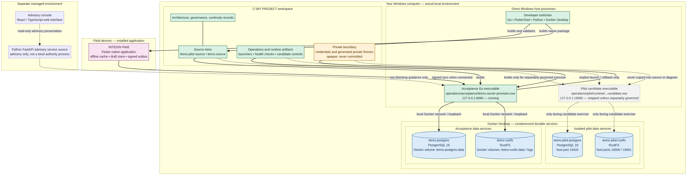

# INTEGIN Installation and Execution Topology

**Status:** Actual local installation model reconciled on 2026-08-18. This document explains where the current project runs; it is not a production deployment specification.

## Short answer

**Your project is a hybrid local environment, not one giant container.** The protected Go acceptance server currently runs **directly on your Windows computer**. PostgreSQL and RustFS run as **Docker containers through Docker Desktop**. The Flutter app is source on the Windows workspace and is compiled into a **native application installed on field devices**. The advisory web console is a **separate managed web environment**, not a service currently hosted inside the local Docker set.

## What is installed where

| Location | Components | Current role |
| --- | --- | --- |
| Windows host | `C:\MY PROJECT`, Go source/build output, Flutter/Dart SDK, Python source, Docker Desktop, operations scripts | Development, compilation, controls, and the protected acceptance server process. |
| Direct Windows process | `operations\acceptance\integin-server-provision.exe` | The protected Go acceptance control, listening on `127.0.0.1:8080`. It was verified healthy and ready. |
| Docker containers | Acceptance PostgreSQL and RustFS; separate pilot PostgreSQL and RustFS | Durable local data and evidence services. The acceptance and pilot containers have separate names, ports, and Docker volumes. |
| Field device | Compiled INTEGIN Field Flutter application | Offline forms, approved work-package cache, local drafts/evidence queue, signing, and outbox synchronization. |
| Separate managed web environment | React/TypeScript advisory console; Python advisory source boundary | Non-blocking advisory presentation and analysis. It is not a local authority service and cannot change workflow state. |
| Pilot candidate executable | `operations\pilot\runtime\` | A disposable direct Windows process that is **currently stopped**. It is launched only for a separately governed loopback candidate exercise. |

## Current container model

Docker Desktop currently hosts the durable services, not the main Go acceptance executable.

| Runtime family | Container | Host exposure | Persistent storage |
| --- | --- | --- | --- |
| Acceptance | `integin-postgres` | Internal Docker service used by acceptance | Docker volume `integin-postgres-data` |
| Acceptance | `integin-rustfs` | Internal Docker service used by acceptance | Docker volumes `integin-rustfs-data` and `integin-rustfs-logs` |
| Isolated pilot | `integin-pilot-postgres` | Loopback port `15432` | Separate pilot Docker volume |
| Isolated pilot | `integin-pilot-rustfs` | Loopback ports `19000` and `19001` | Separate pilot Docker volumes |

This separation is deliberate. The pilot database and evidence service are not the same containers or volumes as acceptance. A pilot experiment can therefore be limited, observed, and restored without modifying the protected acceptance data services.

## Installation flow in practical terms

1. **Developer environment:** The Windows machine holds the workspace, Go toolchain, Flutter/Dart SDK, Docker Desktop, and project operation scripts.
2. **Durable dependencies:** Docker Desktop starts PostgreSQL and RustFS. Docker volumes retain their data independently of a single container process.
3. **Acceptance application:** A reviewed Go build produces the Windows acceptance executable, which runs directly on loopback port `8080` and connects to its local durable services.
4. **Field application:** Flutter builds the native INTEGIN Field app. Once installed on a device, it can work offline and later synchronize signed transactions with the Go platform.
5. **Pilot experiments:** Only when a written candidate plan exists, a separate Windows candidate executable may be launched on loopback port `18080` against the pilot containers. It is rolled back and stopped afterward.
6. **Advisory presentation:** The advisory console is separate from the workflow authority path. It reads and presents advisory context; it is not allowed to approve, reject, or mutate primary records.

## Important distinctions

> **Containerized does not mean “everything is inside Docker.”** In the current local model, Docker is used for durable infrastructure services. The Go server is a direct Windows executable, and the Field app becomes a native device installation.

> **Source code is not the same as a running service.** For example, the Python advisory service and manifest-delivery candidate code exist in the workspace, but they are not automatically running local authority services.

> **Pilot code is not an active production feature.** The pilot candidate is currently stopped. Persistent package enforcement is disabled; OIDC is disabled by default; and OpenBao is sealed and unwired.

## Connection to the main hierarchy map

Use [`INTEGIN_PROJECT_HIERARCHY_2026-08-18.md`](INTEGIN_PROJECT_HIERARCHY_2026-08-18.md) to understand the product and data-flow hierarchy. Use this document to understand **where each part is installed and executed**. Together, the two maps give you both the logical architecture and the real local deployment model.
