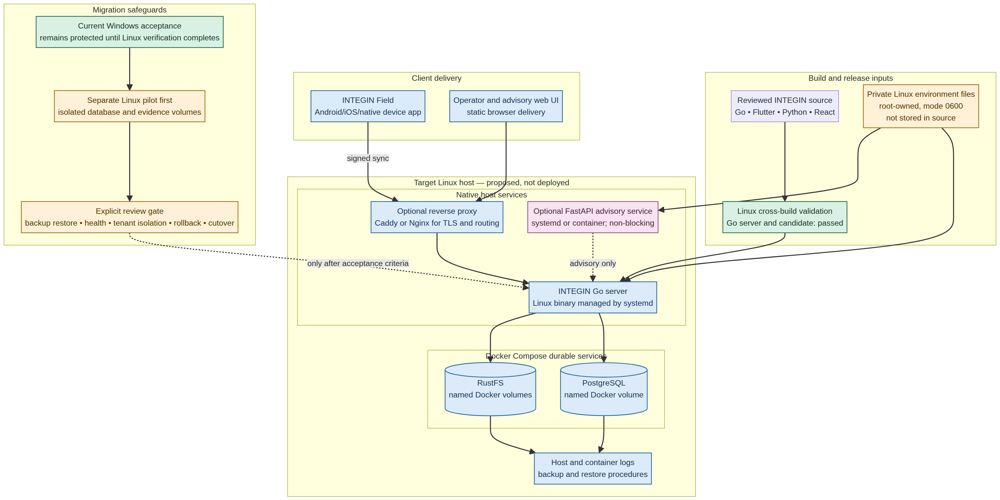

# INTEGIN Linux Runtime Readiness

**Status:** Readiness assessment only. No Linux host, migration, cutover, container change, secret transfer, or acceptance change has been performed.

## Short answer

**Yes. INTEGIN can run on Linux.** Its core Go platform is portable, PostgreSQL and RustFS already use Linux container images, the Flutter source is portable, and the Python advisory service is portable. The most suitable first Linux topology is a **hybrid Linux host**: the Go server runs as a native Linux binary managed by `systemd`, while PostgreSQL and RustFS run through Docker Compose with named volumes.

This mirrors the current local design rather than forcing an unnecessary all-container rewrite. Packaging the Go server itself as a Linux container is also possible later, but it is not required for the first reliable Linux deployment.

## Verified portability today

| Component | Linux readiness | Evidence or required follow-up |
| --- | --- | --- |
| Go acceptance server | Ready to build for Linux `amd64` | Cross-build completed successfully. |
| Go pilot candidate | Ready to build for Linux `amd64` | Cross-build completed successfully. It remains candidate-only. |
| PostgreSQL and RustFS | Ready for Linux Docker Engine | Current local services already use the same Linux OCI images through Docker Desktop. |
| Python FastAPI advisory service | Portable | Requires a Linux virtual environment, service definition, or container; it remains advisory-only. |
| React/TypeScript advisory UI | Portable web artifact | Can be served as static assets by a Linux web server or other managed web host. |
| Flutter Field business source | Portable | Current project scaffolding contains `web` and `windows` runners only. Add Linux/Android/iOS platform runners and validate them before claiming those packages are ready. |
| PowerShell operations scripts | Windows-specific | Recreate their behavior as shell scripts, Docker Compose commands, and `systemd` units; do not copy them unchanged. |

## Recommended first Linux layout

| Layer | Recommended Linux form | Reason |
| --- | --- | --- |
| Go platform | Native Linux binary, `systemd` managed | Closest operational match to the current direct Windows acceptance executable; straightforward health checks and rollback. |
| PostgreSQL | Docker Compose container with named volume | Matches the existing durable-service model and makes service isolation explicit. |
| RustFS | Docker Compose container with named volumes | Matches existing evidence storage separation and log/data persistence. |
| TLS / public routing | Caddy or Nginx, only when external access is required | Keeps TLS and HTTP routing outside application business code. |
| Secrets | Root-owned environment file, not repository content | Replaces the private Windows file boundary while keeping values outside source. |
| Backups and observability | Scheduled database/evidence backups plus host/container logs | Required before any cutover decision. |

## What will not be copied directly

The Windows acceptance executable and `.ps1` scripts are **not** deployed as-is to Linux. Linux receives a new Go binary built for the target architecture and separate operations artifacts: `systemd` unit files, shell/Compose controls, and root-owned environment files. The Windows workspace remains a valid development and protected-acceptance reference until a Linux acceptance candidate has proven health, tenant isolation, backup restore, and rollback.

## Safe migration sequence

1. **Prepare a separate Linux pilot host.** Install Docker Engine/Compose, Go, and required build tools. Do not touch the Windows acceptance runtime.
2. **Deploy isolated pilot infrastructure.** Use new Docker volumes for Linux pilot PostgreSQL and RustFS. Restore only approved disposable or copied pilot data under a documented recovery process.
3. **Build and start Linux pilot only.** Cross-build or build natively, load protected configuration through root-owned files, then validate health, readiness, tenant isolation, evidence storage, and rollback.
4. **Validate Field and advisory delivery.** Generate and validate the required Flutter platform runners; publish the web UI separately if required. Keep advisory paths non-blocking.
5. **Run cutover rehearsal.** Prove backup restore, an explicit rollback route to the Windows control, and no acceptance interruption.
6. **Request a separate acceptance cutover decision.** Only after the Linux pilot evidence is reviewed should a production-policy decision be considered.

> The Linux pilot and any future acceptance cutover are distinct governance stages. The current Windows acceptance remains the protected control until a future Linux candidate passes the documented evidence gates.

## Current gate

The immediate next practical task is **not** a cutover. It is to prepare a reviewed Linux deployment manifest and validation runbook for a separate pilot host. That work must include backup/restore, service health, tenant isolation, opaque secret handling, and rollback to the existing Windows acceptance path.
