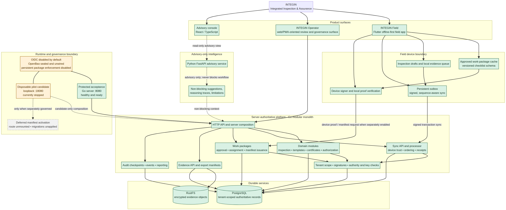

# INTEGIN Project Hierarchy and Behind-the-Scenes Map

**Status:** Current implemented architecture and governed pilot boundary as reconciled on 2026-08-18.

The diagram is intentionally organised by **responsibility**, rather than by a raw repository tree. A source tree tells you where files are stored; this map shows what each part of INTEGIN does, how information moves, and which controls prevent a pilot experiment from changing the protected system.

## How INTEGIN works behind the scenes

An inspection begins in **INTEGIN Field**, the native Flutter app. A device holds approved, versioned work-package content locally so an inspector can work offline. It keeps drafts and evidence locally, then places signed changes in a persistent outbox. When connectivity is available, the outbox sends device-signed, sequence-aware transactions to the Go platform. The server verifies tenant scope, device trust, signatures, authority information, ordering, and request identity before it records an authoritative outcome.

The **Go modular monolith** is the system of record. Its HTTP layer is only an entry point; the business rules live in separate modules for inspections, templates, certificates, authorization, synchronization, work packages, evidence, audit, reporting, and platform controls. PostgreSQL retains tenant-scoped authoritative records, sequence state, receipts, work-package assignments, and audit/event data. RustFS stores encrypted evidence objects; PostgreSQL stores the associated metadata and reference trail.

The **AI service** is deliberately outside the decision path. Python FastAPI and the advisory console can analyse information and present non-blocking suggestions, reasoning traces, or limitations. They cannot approve, reject, change, or block an inspection workflow. The server remains the sole authority for workflow state.

| Architectural layer | Main responsibility | Examples in this project |
| --- | --- | --- |
| Product surfaces | What people use | INTEGIN Field, future operator web/PWA surface, advisory console |
| Device boundary | Offline resilience and cryptographic proof | Cached work packages, drafts, outbox, device signer |
| Platform authority | Business rules and trusted decisions | Go server, domain modules, sync processor, work-package services |
| Durable services | Long-lived trusted data | PostgreSQL and RustFS |
| Advisory intelligence | Explain and assist without control | Python FastAPI, React/TypeScript advisory UI |
| Governance boundary | Keeps experimentation contained | Protected acceptance, candidate-only pilot execution, explicit rollback |

## The normal inspection journey

| Step | What happens | Why it matters |
| --- | --- | --- |
| 1. Receive approved content | A device receives a signed, versioned work package for a specific assignment. | The field form is controlled content, not arbitrary client-side configuration. |
| 2. Work offline | The inspector completes a local draft and captures evidence. | Field work continues through poor or absent connectivity. |
| 3. Queue signed changes | The app stores signed transactions in its persistent outbox. | Work is not lost and can be retried safely. |
| 4. Synchronize | The Go platform validates device, tenant, signature, sequence, and authority scope. | The server prevents a device from becoming the authority. |
| 5. Persist authoritative results | PostgreSQL records durable workflow/audit state and RustFS receives evidence objects. | Inspection history and evidence remain traceable and tenant-isolated. |
| 6. Present advisory context | Optional advisory services add non-blocking explanation or signal. | AI helps people without mutating primary workflow state. |

## Runtime separation

The project maintains two deliberately different runtime contexts. The **acceptance control** at `127.0.0.1:8080` is protected and currently healthy. The **pilot candidate** at `127.0.0.1:18080` is a disposable loopback process used only for separately governed experiments; it is currently stopped. The pilot data-backed policy matrix ran there, rolled back explicitly, and did not change acceptance.

> Package enforcement is disabled in every persistent runtime. OIDC is disabled by default. OpenBao is sealed and unwired. These are protective defaults, not unfinished accident states.

The device-authenticated manifest-delivery source is implemented and source-validated, but its candidate activation remains deferred: its route is unmounted, its pilot migrations are unapplied, and any future candidate exercise requires its own review, rollback plan, and non-secret evidence record.

## Where this architecture lives

| Workspace location | What it contains |
| --- | --- |
| `integin-pilot-source\internal\` | Go modules for domain, sync, security, storage, work packages, evidence, audit, advisory, and server composition |
| `integin-pilot-source\field_app\lib\` | Flutter Field layers for application, domain, security, storage, sync, outbox, evidence, and work packages |
| `integin-pilot-source\ai_service\` | Python FastAPI advisory boundary |
| `integin-advisor-ui\` | React/TypeScript evidence-linked advisory console |
| `operations\` | Local launchers, health checks, candidate controls, and recovery procedures |
| `docs\architecture\` | Architecture and delivery-model records |
| `docs\governance\` | Pilot evidence, controls, and readiness records |

## Reading the visual

Green nodes are implemented components and currently available durable services. Amber nodes are **governance boundaries**: they are deliberately restricted because an action there can affect a runtime. The dashed grey node is a planned but disabled capability. Dashed arrows show advisory or separately-governed paths rather than normal always-on workflow traffic.

### Project records

This map is grounded in the active source modules, current runtime checks, [`CURRENT_STATE.md`](../../CURRENT_STATE.md), [`WORKSPACE_MAP.md`](../../WORKSPACE_MAP.md), [`PRODUCT_DELIVERY_MODEL.md`](PRODUCT_DELIVERY_MODEL.md), and the two 2026-08-18 pilot governance records: [`PILOT_POLICY_DATA_BACKED_MATRIX_EVIDENCE_2026-08-18.md`](../governance/PILOT_POLICY_DATA_BACKED_MATRIX_EVIDENCE_2026-08-18.md) and [`PILOT_MANIFEST_DELIVERY_SOURCE_READINESS_REVIEW_2026-08-18.md`](../governance/PILOT_MANIFEST_DELIVERY_SOURCE_READINESS_REVIEW_2026-08-18.md).
