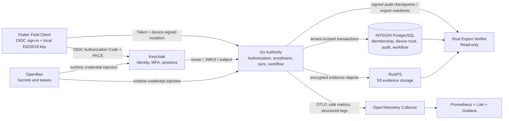

# INTEGIN Production-Trust Baseline Roadmap

**Status:** Planning baseline — no new service deployment authorized by this document  
**Date:** 2026-08-15  
**Decision scope:** The next production-ready trust capabilities for INTEGIN after successful local Flutter, PostgreSQL, RustFS, and recovery validation.

## 1. Purpose

INTEGIN now has working local evidence that the authoritative server accepts a provisioned Flutter device's signed sync and encrypted evidence submissions, persists the resulting state in PostgreSQL, stores evidence through RustFS, and survives isolated backup/restore drills. The remaining challenge is not to add technology for its own sake; it is to turn that proven local design into a controlled production-trust baseline.

> **Every production capability must preserve one accountable owner, one authoritative write path, explicit tenant/organization/environment context, an auditable decision, and a tested recovery procedure.**

This roadmap sequences the smallest set of additions that materially improve production trust: self-hosted human identity, production secrets, production device enrollment, contract governance, tenant-safe observability, and independently verifiable audit/export evidence. It deliberately prevents a second tenant/workflow authority from emerging beside the existing Go/PostgreSQL modular monolith.

## 2. End-state authority model

| Component | Sole responsibility | It must not become |
|---|---|---|
| Keycloak | Human/service authentication, MFA, OIDC sessions, client identity | Tenant/workflow/device/offline-authority source of truth |
| OpenBao | Operator-controlled secrets, credential leasing and revocation | Evidence storage, audit database, customer workflow dependency |
| Go authority | Authorization, enrollment, device trust, offline authority, workflow acceptance | Identity-password store or telemetry warehouse |
| INTEGIN PostgreSQL | Durable authoritative state, local membership, RLS, audit history | Object storage, secrets manager, identity-provider database |
| RustFS | Encrypted evidence object storage and export artifacts | Inspection/certificate/audit authority |
| OTel/Prometheus/Loki/Grafana | Safe operational telemetry and operator visibility | Primary audit record or evidence archive |
| Rust verifier | Read-only independent verification of exports/checkpoints | A workflow write path or a policy authority |

## 3. Production-trust baseline

| Baseline element | Priority | Reason for inclusion | Current status |
|---|---:|---|---|
| Keycloak with separate PostgreSQL identity database | P0 | Establishes self-hosted OIDC, MFA, session and service-identity boundary. [1] [2] | Design selected; not deployed |
| OpenBao | P0 | Replaces scattered production credentials with encrypted storage, ACLs, leased/revocable secrets, and controlled rotation. [3] | Recommended; not deployed |
| Production device enrollment | P0 | Replaces local-only provisioning with OIDC-bound, public-key-only, proof-of-possession and approval-based trust. | Draft specified; not implemented |
| OpenAPI v1 and canonical test vectors | P0 | Prevents protocol drift across Go, Flutter, and future operations clients. | Governance requirement; not published |
| Evidence export manifest v1 | P0 | Makes every portable evidence export traceable, integrity-verifiable, and recoverable. | Schema drafted in governance backlog; not implemented |
| OTel + Prometheus + Loki + Grafana | P1 | Provides operational evidence and alerting without storing sensitive application material. [4] | Recommended; not deployed |
| Signed INTEGIN audit checkpoints | P1 | Provides independent tamper evidence without a blockchain or second database. | Design required; not implemented |
| Rust export verifier | P2 | Validates exports and checkpoints without database write access. | Planned; not implemented |
| step-ca internal PKI | P2 | Enables short-lived internal service certificates/workload mTLS if later justified. [5] | Explicitly deferred |

## 4. Sequenced workstreams and promotion gates

### Workstream 0 — Foundation freeze and production rules

**Objective:** Establish the versioned contracts, ownership model, secret inventory, and release evidence required before any shared rollout.

| Deliverable | Accountable owner | Exit evidence |
|---|---|---|
| Approve the production device-enrollment, OIDC/authorization, and initial offline-authority policies | Security Operator + Product/Safety Authority | Signed decision record naming the eight-hour initial offline-authority default, 24-hour global cap, privileged-device separation of duties, and the conditions for later revision. |
| Publish OpenAPI v1 for every client-facing endpoint | Engineering Change Owner | Generated schema, error/outcome definitions, Go/Flutter compatibility check, canonical signed-envelope vectors, and version/deprecation policy. |
| Publish evidence export manifest v1 | Product/Safety Authority + Platform Operator | Tenant-safe JSON schema, sample export, manifest checksum, object/digest link validation, and recovery verification rules. |
| Create production secret inventory and data classification | Security Operator | Every credential/key reference has an owner, storage location, rotation method, access policy, recovery method, and log-redaction rule. |
| Freeze `localprovision` boundary | Engineering Change Owner | Configuration test proves local provisioning and production enrollment are mutually exclusive; production images default local provisioning to disabled. |

**Promotion gate:** No customer/shared field rollout, OIDC deployment, or production device-enrollment implementation begins until all five artifacts are reviewed and approved.

### Workstream 1 — OpenBao production secrets boundary

**Objective:** Establish centrally governed production secret handling before adding production identity or enrollment services.

| Implementation slice | Required control | Fitness test |
|---|---|---|
| Deploy OpenBao in an isolated operator boundary | TLS, distinct operator identities, encrypted storage, restricted network access, audit device, recovery/unseal runbook | A new runtime can retrieve only its assigned non-production fixture secret; unauthorized role and network paths fail. |
| Define policies and paths | Separate paths for Keycloak, INTEGIN Go runtime, PostgreSQL migration, RustFS, SMTP, signing-key references, and CI | One workload cannot read another workload's secret path; policy review is version controlled. |
| Move production credentials by reference | No secret values committed to source; local `C:\integin-secrets` remains development-only | Credential rotation changes a running service through the defined safe restart/reload procedure and leaves no value in logs. |
| Prove recovery | Encrypted backup, dual-control recovery material, tested restoration procedure | Restore into isolated environment and confirm access policies/audit configuration are intact. |

**Stop conditions:** Do not rely on a single human-held unseal/recovery value, do not store Flutter private keys, and do not block an accepted field transaction solely because a nonessential secret-refresh call is temporarily unavailable.

### Workstream 2 — Casdoor Go-native identity-only service (Standardized per ADR 0032)

**Objective:** Standardize on Casdoor as the Go-native, lightweight, Apache-2.0 self-hosted OIDC provider (replacing Keycloak per ADR 0032) without creating a competing tenant-authorization model.

| Implementation slice | Required control | Fitness test |
|---|---|---|
| Deploy Casdoor with isolated database | Dedicated PostgreSQL container (`integin-pilot-casdoor-postgres`), non-owner runtime credentials, isolated network, pinned image digest | Isolated identity-database restore permits a controlled test login but does not change INTEGIN business state. |
| Configure environment application & clients | One organization per environment (`integin-pilot`); exact redirect/CORS URLs; no implicit grant; PKCE/authorization code | Cross-environment token, wildcard callback, and non-PKCE client attempts are rejected. |
| Configure authentication assurance | Password and MFA for privileged roles; short access tokens (MaxTokenAge ≤ 15m) and refresh rotation | A Tenant Administrator cannot approve enrollment without required MFA/step-up. |
| Configure service clients | One confidential service account per automation; narrow audience and least privilege | A service account cannot impersonate a person, approve a device, create tenant membership, or access an unrelated tenant. |
| Operate and recover | Admin audit logs, key rotation, session invalidation, backup/restore exercise | Invalid issuer/audience/signature/expiry and stale JWKS key tests all fail closed. |

**Stop conditions:** Do not use an organization per customer tenant, do not infer authorization from Casdoor group/role claims alone, and do not expose the Casdoor administration console on a public unauthenticated route.

### Workstream 3 — Go OIDC integration and local authorization projection

**Objective:** Bind authenticated identity to the existing Go/PostgreSQL authorization and RLS controls.

| Implementation slice | Required control | Fitness test |
|---|---|---|
| Add OIDC discovery/JWKS middleware | Validate TLS, issuer, audience, authorized party where applicable, key signature, timing claims, and token type | Invalid or wrong-audience token never reaches a repository. |
| Create local subject/membership projection | Immutable `(issuer, sub)` mapping; email/name are profile values only; tenant membership remains local | Email change does not create a second identity or grant a tenant role. |
| Bind request to tenant/organization | Server resolves selected membership and sets PostgreSQL tenant context transactionally | URL/body/claim tenant spoof attempts fail RLS and application authorization. |
| Apply separation of duties | Reuse the Go authorization engine for capability, workflow, device, authority and approval rules | OIDC administrator claim alone cannot approve a safety-critical action without local capability and current membership. |
| Audit privileged actions | Record identity subject, local membership, action, reason, correlation ID, and result | Audit log can trace an approved/rejected enrollment decision without recording the OIDC token. |

**Promotion gate:** Cross-tenant, disabled-user, expired-session, missing-MFA, token-key rotation, and RLS tests must pass before any production enrollment route is enabled.

### Workstream 4 — Production device enrollment and offline authority

**Objective:** Replace the local integration bridge with the approved production flow defined in `PRODUCTION_DEVICE_ENROLLMENT_SPEC.md`.

| Implementation slice | Required control | Fitness test |
|---|---|---|
| Persist requests/challenges/proofs/approvals | RLS, bounded/hashed single-use challenge storage, idempotency and retention controls | Replay, expiration, duplicated proof, and cross-tenant request attempts fail closed. |
| Implement Ed25519 proof of possession | Client generates private key locally; server accepts public key plus canonical signed challenge only | Tests prove private-key values do not cross network, logs, database, archive, or support artifact boundaries. |
| Implement approval workflow | Authenticated tenant administrator, current local capability, explicit reason, privileged/self-approval separation | Insufficient role, self-approval, expired request, and mismatched organization are rejected. |
| Issue/revoke authority packages | Server-derived scope, device epoch, procedure/policy references, bounded expiry, signing key ID | Client-supplied scope/duration is ignored; post-revocation authority is rejected by sync. |
| Implement recovery/replacement | New key, old device lock/revoke, immutable linkage/audit record | Lost-device replacement cannot silently resurrect the old authority or erase history. |

**Promotion gate:** Run real Flutter-to-production-like acceptance with human OIDC sign-in, approval, scoped authority, `APPLIED` sync/evidence, deliberate revoke, rejected post-revoke sync, and PostgreSQL/RustFS/audit verification.

### Workstream 5 — Operational evidence and release control

**Objective:** Make authority-path operation observable and recoverable without leaking sensitive data.

| Implementation slice | Required control | Fitness test |
|---|---|---|
| Instrument Go and supporting services with OTel | Correlation IDs; allowlisted dimensions only; no evidence bytes, secrets, tokens, full payloads, or raw personal profiles | Automated log/trace scan shows prohibited values absent from fixture telemetry. |
| Deploy Collector + Prometheus + Loki + Grafana | Segmented network, role-based dashboard access, defined retention, backup of critical dashboard/alert configuration | Trace one synthetic sync/evidence flow end-to-end and show exact expected metrics/logs. |
| Add minimum alert set | Readiness, security failures, held backlog age, authority expiry, evidence failure, backup/recovery age | Controlled synthetic failure generates alert without exposing tenant content. |
| Publish release record template | Artifact checksum, migration list, tests, dependency versions, backup/restore evidence, approval, rollback trigger | A release rehearsal produces a complete record that an independent reviewer can assess. |

**Stop conditions:** Grafana/Loki is not the audit system of record; telemetry failures must not stop a server-authoritative inspection workflow; and alert labels must not contain unbounded identifiers or sensitive content.

### Workstream 6 — Signed checkpoints, export verification, and independent assurance

**Objective:** Add portable tamper-evidence and recovery verification while preserving a single write authority.

| Implementation slice | Required control | Fitness test |
|---|---|---|
| Define canonical audit-checkpoint input | Deterministic event ordering, versioned hash domain separation, explicit sequence bounds, key ID | Go creates identical hash roots for fixed vectors; malformed/reordered data fails verification. |
| Sign and persist checkpoints | Dedicated audit-attestation key reference, PostgreSQL metadata, RustFS immutable export artifact | A verifier accepts the authentic checkpoint and rejects altered event/object data. |
| Implement evidence export manifest v1 | Tenant-scoped manifest, object keys, dual digests, authority/receipt linkage, classification/retention/approval data | Export to isolated location then validate every listed object and digest without DB write access. |
| Build read-only Rust verifier prototype | No production credential or write capability; pinned input/output contracts | Verify a clean export, then prove one altered object and one altered checkpoint fail. |
| Run recovery exercise | Restore PostgreSQL/RustFS and independently verify manifest/checkpoints | Recovery record names source checksum, restored checksum, exceptions, operator and reviewer. |

**Promotion gate:** A Safety Authority and Platform Operator can independently validate a sample export and recovery drill without using the INTEGIN application UI.

## 5. Explicitly deferred controls

| Deferred component | Reconsider only when | Why it is not in the baseline |
|---|---|---|
| step-ca / internal PKI | Multiple services or workload mTLS creates a demonstrated certificate-rotation need | Flutter Ed25519 device signatures and INTEGIN authority packages remain the correct field trust mechanism. |
| Rauthy | A compact/passkey-intensive identity edge becomes a measured need and continuity review passes | Keycloak has the lower ecosystem/operations risk for the central identity service. |
| OPA, OpenFGA, Ory Keto, or another authorization graph | The existing Go authorization engine cannot express measured, reviewable relationship policy needs | They would otherwise duplicate the tested Go/PostgreSQL/RLS authority. |
| Blockchain or separate immutable audit database | Independent signed checkpoint/export verification fails to satisfy regulatory or customer evidence requirements | It creates a second audit authority, replication problem, and recovery surface. |
| Kubernetes, service mesh, Kafka, Redis, SIEM | Measured scale, availability, integration, or security-monitoring data proves a clear need | They add high operational load before the modular monolith requires them. |

## 6. Ownership and first approvals

| Decision | Proposed accountable owner | Required approvers |
|---|---|---|
| Identity policy and Keycloak configuration | Security Operator | Product/Safety Authority, Platform Operator |
| Production enrollment and authority policy | Security Operator | Tenant Administrator representative, Product/Safety Authority |
| Secret policy, recovery, and rotation | Security Operator | Platform Operator |
| Telemetry classification, dashboards, and alert thresholds | Platform Operator | Security Operator, Product/Safety Authority for safety-related alerts |
| Audit checkpoint and export-verifier contract | Engineering Change Owner | Product/Safety Authority, Platform Operator |
| Release promotion | Engineering Change Owner | Platform Operator, Security Operator, Product/Safety Authority according to risk class |

## 7. First implementation decision

The next implementation work should begin only after reviewing this roadmap and approving Workstreams 0–2. The recommended first executable slice is deliberately small:

1. Freeze and publish OpenAPI v1 plus canonical signed test vectors.
2. Complete the secret inventory and OpenBao recovery design.
3. Deploy non-production Keycloak with a separate PostgreSQL database and configure only a test realm/client.
4. Implement Go token validation and local subject mapping behind a disabled-by-default feature flag.
5. Run token, RLS, and recovery tests before enabling any production device enrollment.

This sequence creates production option value without disturbing the active loopback integration runtime or exposing customer workflows to an untested new authority path.

## References

[1]: https://www.keycloak.org/docs/latest/server_admin/index.html "Keycloak Server Administration Guide"

[2]: https://github.com/keycloak/keycloak "Keycloak source repository"

[3]: https://openbao.org/ "OpenBao"

[4]: https://grafana.com/docs/loki/latest/send-data/otel/otel-collector-getting-started/ "OpenTelemetry Collector and Loki"

[5]: https://smallstep.com/docs/step-ca/ "step-ca server"

[6]: ./PLATFORM_GOVERNANCE_BACKLOG.md "INTEGIN Platform Governance Backlog"

[7]: ./PRODUCTION_DEVICE_ENROLLMENT_SPEC.md "INTEGIN Production Device Enrollment Specification"

[8]: ./IDENTITY_AUTHORIZATION_DESIGN.md "INTEGIN Self-Hosted Identity and Authorization Design"
